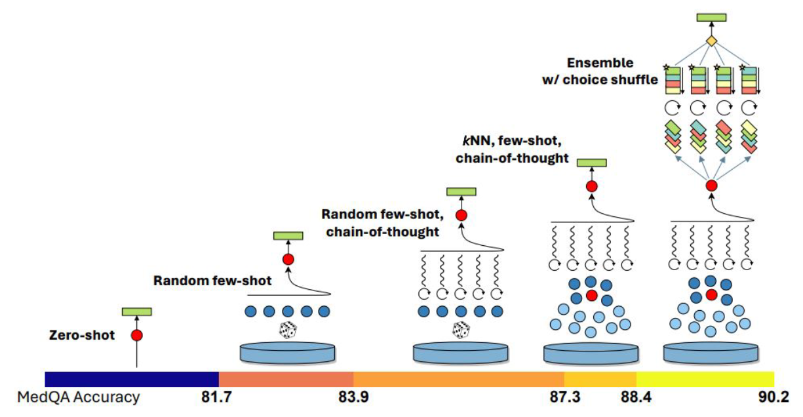

## 📊 TNM Cancer Staging Using LLMs and Innovative Prompting Techniques

This repository contains the official preprint of the research article:

"TNM Cancer Staging with Large Language Models: Comparative Analysis of MedPrompt and Other Structured Prompting Techniques"

Authors: Rodrigo Stall, Gabriel Lino Garcia and João Paulo Papa

📌 Abstract

TNM cancer staging is essential for assessing cancer severity, guiding treatment decisions, and predicting clinical outcomes. 
This standardized system allows healthcare professionals to assess tumor progression and tailor treatment strategies accordingly.
Although large language models (LLMs) show promise in automating TNM staging, their clinical reliability depends on strict ad-
herence to oncological guidelines. This study evaluates the performance of three LLMs—GPT-4-o mini, LLaMA 3.3 70B Instruct,
and DeepSeek-R1-Distill-LLaMA-70B—in classifying TNM stages across 1,000 TCGA pathology reports from 33 cancer types.
We compare traditional prompting techniques, including Zero-Shot and Zero-Shot with Chain-of-Thought, with the specialized
MedPrompt and two novel methodologies: Approach A, which mimics the step-by-step reasoning process of medical profession-
als using self-generated staging rules, and Approach B, which follows the same structured process while explicitly integrating
AJCC guidelines. Our findings show that Approach B achieved state-of-the-art results in the N and M categories, with N macro
average precision reaching 0.88 and M macro average precision reaching 0.91. Additionally, MedPrompt achieved the highest
mean macro average precision across the three TNM categories, with a score of 0.867. These findings highlight the critical role of
domain-specific structured prompting in improving LLM accuracy, minimizing hallucinations, and ensuring clinical reliability in
automated TNM cancer staging.

## 📊 Model Architecture

## 🧠 MedPrompt – Advanced Structured Prompting for Medical AI

  

MedPrompt is an advanced prompting framework specifically designed to enhance the performance of Large Language Models (LLMs) in medical tasks.

It integrates a combination of state-of-the-art techniques, including:

- K-Nearest Neighbors (KNN)  
- Few-Shot Learning  
- Self-Generated Chain-of-Thought  
- Self-Consistency  

At its core, MedPrompt adapts the model’s input to leverage both contextual and example-driven learning.

It operates as follows:

#### 1️⃣ Contextual Example Retrieval (KNN)
Relevant examples are embedded within the prompt using a K-Nearest Neighbors approach to select cases most similar to the current task.  
This ensures the model is informed by contextually relevant clinical data.

#### 2️⃣ Structured Reasoning (Chain-of-Thought)
The integration of Chain-of-Thought allows the model to:
- Articulate reasoning step-by-step  
- Improve interpretability  
- Generate logically coherent outputs  

#### 3️⃣ Self-Consistency Aggregation
Multiple outputs are generated and aggregated to identify the most consistent and reliable prediction.  
This reduces variability and improves decision robustness.

---

### 🔀 Options Shuffling Strategy

A notable aspect of MedPrompt is its use of **options shuffling**, which dynamically adjusts the prompt by altering the structure of the provided options.

This enhances accuracy by:
- Preventing positional bias  
- Encouraging deeper reasoning  
- Forcing evaluation from multiple perspectives  

This is particularly effective in tasks involving complex medical reasoning.

---

### 🎯 Combined Effect

The integration of example retrieval, structured reasoning, and self-consistency results in:

- Significant improvements in medical prediction accuracy  
- Reduced hallucination rates  
- Increased reliability and consistency  
- Contextually appropriate outputs  

MedPrompt’s holistic approach blends data-driven and reasoning-based techniques, making it highly effective for precision-critical medical applications such as TNM cancer staging.

## 🧠 Approach A – Self-Generated AJCC Rule Framework

  

Approach A aims to replicate the steps commonly followed by an oncologist when classifying a TNM cancer stage.

The method proceeds sequentially:
1. Identifying the cancer location  
2. Applying AJCC staging rules specific to that location  

The structured workflow consists of the following steps:

---

### 🔎 Structured Workflow

#### 1️⃣ Prompt Initialization  
The LLM is provided with a general prompt containing contextual information about TNM cancer staging to establish domain grounding.

#### 2️⃣ Cancer Location Identification  
The model is asked to identify the cancer location from the clinical pathology report.

#### 3️⃣ Staging Rule Application (Self-Generated)  
The LLM self-generates the AJCC staging rules relevant to the identified cancer location.

The model relies on:
- Internal knowledge
- Reasoning abilities
- Implicit understanding of AJCC guidelines  

This approach does **not** use externally injected staging rules.

#### 4️⃣ Chain-of-Thought Generation  
The model generates a structured Chain-of-Thought to reason through the staging process, ensuring each classification step is logically justified.

#### 5️⃣ Classification Generation  
Finally, the model produces:
- T (Tumor) classification  
- N (Nodes) classification  
- M (Metastasis) classification  

Providing a complete TNM staging result.

---

This approach is designed to simulate the cognitive reasoning process of an oncologist, following a structured methodology to derive accurate and contextually appropriate TNM classifications.

## 🧠 Approach B – AJCC-Guided Structured TNM Framework

  

In this approach, we replicate the steps typically used by oncologists for TNM cancer staging, similar to Approach A, but with a key distinction:

Instead of generating the AJCC Classification Staging Rules, we provide them directly to the model.

This ensures stricter control over the staging criteria and significantly reduces hallucination risks.

Additionally, the LLM is instructed to:
- Summarize the clinical case
- Identify tumor size
- Reason through each TNM component
- Generate a structured Chain-of-Thought
- Assign final TNM classifications

---

### 🔎 Structured Workflow

#### 1️⃣ Cancer Category Classification
A dedicated LLM classifier first identifies the cancer location based on AJCC Cancer Staging Manual categories.

#### 2️⃣ Staging Rules Input
Once the cancer type is identified, the corresponding AJCC staging rules are explicitly provided to the model.

This guarantees:
- Strict rule adherence  
- Controlled decision boundaries  
- Reduced hallucinations compared to self-generated rule strategies  

#### 3️⃣ Few-Shot Examples Input
Cancer-specific few-shot examples are included to guide reasoning and illustrate correct staging decisions.

---

### 🏥 Clinical Case Analysis Pipeline

The LLM performs the following structured steps:

1. Generate a summary of the clinical case  
2. Identify tumor size  
3. Provide reasoning for the **T stage** classification  
4. Provide reasoning for the **N stage** classification  
5. Provide reasoning for the **M stage** classification  
6. Generate a self-guided Chain-of-Thought  
7. Assign the final **T classification**  
8. Assign the final **N classification**  
9. Assign the final **M classification**

---

This structured decomposition mirrors real-world oncological reasoning while maintaining full alignment with AJCC guidelines.

📩 Contact

Rodrigo Stall

rodrigo.stall.sikora@gmail.com

Data Scientist and Machine Learning Engineer
