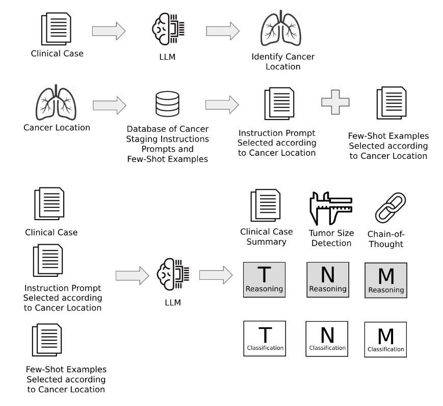

This repository contains the official preprint of the research article:

"TNM Cancer Staging with Large Language Models: Comparative Analysis of MedPrompt and Other Structured Prompting Techniques"

📌 Abstract

TNM cancer staging is essential for assessing cancer severity, guiding treatment decisions, and predicting clinical outcomes. 
This standardized system allows healthcare professionals to assess tumor progression and tailor treatment strategies accordingly.
Although large language models (LLMs) show promise in automating TNM staging, their clinical reliability depends on strict ad-
herence to oncological guidelines. This study evaluates the performance of three LLMs—GPT-4-o mini, LLaMA 3.3 70B Instruct,
and DeepSeek-R1-Distill-LLaMA-70B—in classifying TNM stages across 1,000 TCGA pathology reports from 33 cancer types.
We compare traditional prompting techniques, including Zero-Shot and Zero-Shot with Chain-of-Thought, with the specialized
MedPrompt and two novel methodologies: Approach A, which mimics the step-by-step reasoning process of medical profession-
als using self-generated staging rules, and Approach B, which follows the same structured process while explicitly integrating
AJCC guidelines. Our findings show that Approach B achieved state-of-the-art results in the N and M categories, with N macro
average precision reaching 0.88 and M macro average precision reaching 0.91. Additionally, MedPrompt achieved the highest
mean macro average precision across the three TNM categories, with a score of 0.867. These findings highlight the critical role of
domain-specific structured prompting in improving LLM accuracy, minimizing hallucinations, and ensuring clinical reliability in
automated TNM cancer staging.

## 📊 Model Architecture

📩 Contact

Rodrigo Stall
rodrigo.stall.sikora@gmail.com
Data Scientist and Machine Learning Engineer
